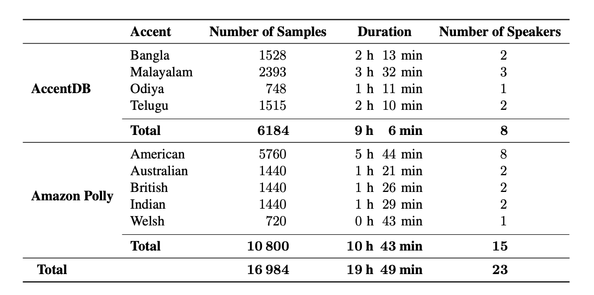

# Evaluating ASR Systems Accent Robustness

Welcome to the repository housing the master thesis research of Prince Canuma, a student of the MSc Big Data Analytics program at Wrocław University of Science and Technology. This body of work reflects the dedication and scientific rigour Prince has applied to his studies.

Authored by Prince Canuma.

To learn more about Prince and his work, feel free to connect with him on:

* [LinkedIn](https://www.linkedin.com/in/prince-canuma/)
* [Twitter](https://twitter.com/CanumaGdt)
  
## Data
AccentsDB is a database with a wide array of native and non-native English accents speech samples from around the world for testing the robustness and adaptability of ASR systems to various accents. In total, it has 23 speakers, 19:49 hours, 16,984 speech samples and 9 accents, split into 4 native accents, namely American, Australian, British, and Welsh; 1 metropolitan Indian accent and 4 non-native accents, namely Bangladeshi, Malayalam, Odiya and Telugu. The AccentsDB does not inherently provide transcriptions, which requires

Figure 1: A table containing details of the AccentsDB statistics. A total of 9 accents, out of which the authors collected 4 and 5 using Amazon Polly an AWS service for generating synthetic natural-sounding human speech from text.

the generation of transcriptions for the entirety of its speech samples. This task was accomplished utilizing **Wav2Vec 2.0**, an advanced open-source model. After this transcription generation, each entry was manually inspected and, where necessary, rectified to ensure the accuracy of the transcriptions.
However, the Malayam accent and a portion of the dataset posed significant challenges due to the lack of aligned speech samples, which complicated the process of generating and verifying the labels. As a result, these were excluded from the study. Consequently, this study’s final subset of AccentsDB comprised 12,614 samples, spanning 8 distinct accents.

Dataset link: https://huggingface.co/datasets/prince-canuma/accentsDB-with-transcripts

## Metrics 
The primary metric for evaluation will be the **Word Error Rate** (WER), which measures the percentage of words that were transcribed incorrectly. Additionally, we will use the **Character Error** (CER) to measure the number of character-level mistakes in the transcriptions. These metrics will provide a clear picture of the transcription accuracy of the evaluated models.

## Tools 
In developing and evaluating the Whisper ASR model, several key tools were utilized, which not only facilitated the research process but also ensured the robustness and reproducibility of the experiments. These tools include **[PyTorch](https://github.com/pytorch/pytorch)**, **[Huggingface Datasets](https://github.com/huggingface/datasets)**, **[Huggingface Transformers](https://github.com/huggingface/transformers)**, and **[Huggingface Hub](https://github.com/huggingface/huggingface_hub)**.

## Models
We will compare the performance of the following ASR models:

* **Whisper**: OpenAI’s ASR system trained on vast and diverse datasets.
* **HuBERT**: Facebook AI’s ASR model pre-trained on LibriSpeech. Developed to have a competitive or superior performance to the wav2vec 2.0 on all fine-tuning subsets.
* **Wav2Vec 2.0**: Facebook AI’s ASR model trained using a novel self-supervised learning approach. 3.5.1 Whisper

